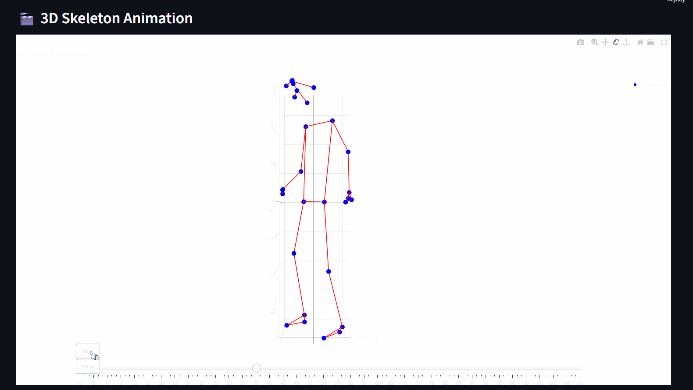
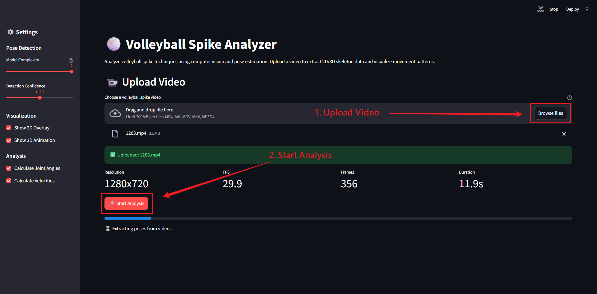
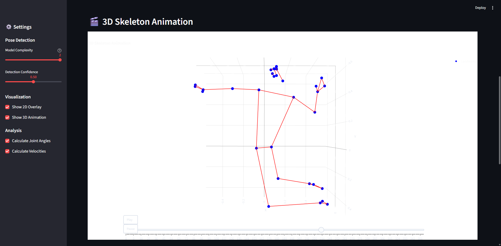
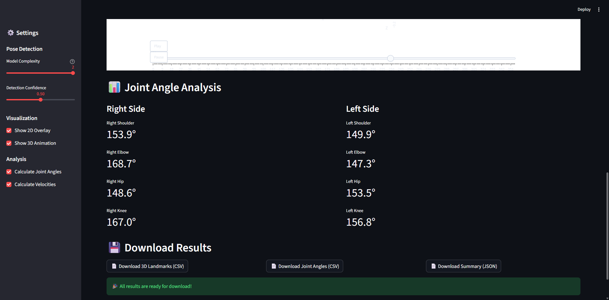

# 🏐 Volleyball Spike Analyzer

A computer vision-based system for analyzing volleyball spike techniques using pose estimation and 3D visualization.



## ✨ Features

### Core Analysis
- **📹 Video Upload** - Support for multiple video formats (MP4, AVI, MOV, MKV)
- **🤖 Pose Extraction** - Real-time skeleton tracking using MediaPipe Pose
- **📊 2D & 3D Coordinates** - Extract both 2D and 3D landmark positions
- **🎬 3D Visualization** - Interactive 3D skeleton animation using Plotly

### Advanced Analysis (NEW)
- **🎯 Phase Detection** - Automatic detection of 5 motion phases (Approach → Takeoff → Arm Swing → Contact → Landing)
- **📐 Joint Angle Analysis** - Calculate key angles (shoulder abduction, elbow flexion, torso rotation)
- **🚀 Velocity Analysis** - Linear and angular velocities for wrist, elbow, and shoulder
- **📏 Spatial Metrics** - Jump height, contact height, flight time, horizontal displacement
- **🏷️ Motion Classification** - Classify arm swing into 5 types (Straight, Bow-Arrow High/Low, Snap, Circular)
- **🔄 Multi-Video Comparison** - Side-by-side comparison with similarity metrics
- **📄 Report Generation** - Comprehensive HTML and text reports

### Export & Integration
- **💾 Data Export** - Export pose data to CSV/JSON for further analysis
- **🖥️ Web Interface** - User-friendly interface built with Streamlit

## 🚀 Quick Start

### Prerequisites

- Python 3.8 or higher
- pip package manager

### Installation

1. **Clone the repository**
```bash
git clone <repository-url>
cd volleyball-spike-analyzer
```

2. **Create a virtual environment** (recommended)
```bash
python -m venv venv

# On Windows
venv\Scripts\activate

# On macOS/Linux
source venv/bin/activate
```

3. **Install dependencies**
```bash
pip install -r requirements.txt
```

### Running the Application

Start the Streamlit web interface:

```bash
streamlit run app.py
```

The application will open in your default web browser at `http://localhost:8501`.

## 📖 How to Use

### 1. Upload Your Video

Upload a volleyball spike video in MP4, AVI, MOV, or MKV format.



### 2. View 3D Skeleton Animation

Explore the interactive 3D skeleton animation with play/pause controls and frame-by-frame navigation.



### 3. Analyze Joint Angles

Review detailed joint angle measurements for shoulders, elbows, hips, and knees.



### 4. Download Results

Export the analysis results:
- **3D Landmarks (CSV)** - Complete 3D coordinate data
- **Joint Angles (CSV)** - Frame-by-frame angle measurements
- **Summary (JSON)** - Statistical summary of the analysis

## 📊 Analysis Features

### Motion Phase Detection

The system automatically detects 5 key phases of volleyball spike motion:

1. **Approach** - Running phase with high horizontal velocity
2. **Takeoff** - Jump initiation with peak vertical acceleration
3. **Arm Swing** - Arm movement from start to peak velocity
4. **Contact** - Ball contact phase around peak hand velocity
5. **Landing** - Descent and ground contact

Additionally, the arm swing phase is further divided into 3 sub-phases based on research literature:
- **Phase I (Initiation)** - Wrist and elbow start rising
- **Phase II (Wind-up)** - Wrist reaches maximum height
- **Phase III (Final Cocking)** - Wrist descends and accelerates

### Arm Swing Classification

The system classifies arm swing motions into 5 types:

1. **Straight** - High arc motion with stopping
2. **Bow-Arrow High** - Very high arc with stopping (maximum power)
3. **Bow-Arrow Low** - Medium arc with stopping (balanced approach)
4. **Snap** - Horizontal motion at shoulder height (quick attack)
5. **Circular** - Continuous low motion without stopping (fastest)

### Biomechanical Metrics

**Joint Angles:**
- Shoulder abduction angle
- Shoulder horizontal abduction
- Elbow flexion angle
- Torso rotation angle
- Torso lean angle

**Velocity Metrics:**
- Wrist linear velocity (max, mean, at contact)
- Elbow linear velocity
- Shoulder linear velocity
- Shoulder angular velocity
- Elbow angular velocity

**Spatial Metrics:**
- Jump height (2 calculation methods)
- Contact point height
- Flight time
- Horizontal displacement (forward & lateral)
- Center of mass trajectory

### Multi-Video Comparison

Compare multiple spike videos side-by-side:
- Aligned velocity profiles (synchronized by contact frame)
- Radar charts for performance metrics
- Similarity scoring between techniques
- Comparison tables with all key metrics

### Report Generation

Generate comprehensive analysis reports:
- **HTML Reports** - Interactive, styled reports with all metrics
- **Text Reports** - Plain text summaries for quick review
- **CSV Exports** - Detailed frame-by-frame data for custom analysis
- **JSON Exports** - Structured data for programmatic access

## 🏗️ Project Structure

```
volleyball-spike-analyzer/
├── app.py                              # Main Streamlit application
├── config/
│   └── config.yaml                     # Configuration settings
├── src/
│   ├── core/
│   │   ├── pose_extractor.py          # MediaPipe pose extraction
│   │   └── skeleton_processor.py      # Skeleton data processing
│   ├── analysis/                       # Analysis modules (NEW)
│   │   ├── phase_detector.py          # 5-phase and 3-phase detection
│   │   ├── joint_angles.py            # Joint angle calculations
│   │   ├── velocity_calculator.py     # Linear & angular velocity
│   │   ├── spatial_metrics.py         # Jump height, displacement
│   │   ├── arm_swing_classifier.py    # Motion type classification
│   │   └── metrics_summary.py         # Results aggregation
│   ├── comparison/                     # Multi-video comparison (NEW)
│   │   └── multi_video_comparator.py  # Side-by-side comparison
│   ├── reporting/                      # Report generation (NEW)
│   │   └── report_generator.py        # HTML/Text reports
│   ├── visualization/
│   │   ├── video_overlay.py           # 2D skeleton overlay
│   │   └── skeleton_3d.py             # 3D visualization
│   └── utils/
│       ├── video_io.py                # Video I/O operations
│       └── data_export.py             # Data export utilities
├── tests/
│   ├── test_pose_extractor.py         # Unit tests
│   └── test_joint_angles.py           # Angle calculation tests
└── data/
    ├── input/                          # Input videos
    ├── output/                         # Processed results
    └── cache/                          # Temporary cache
```

## ⚙️ Configuration

Customize the system by editing `config/config.yaml`:

### MediaPipe Settings
- **model_complexity** (0-2): Higher values = more accurate but slower
- **min_detection_confidence** (0.0-1.0): Minimum confidence for initial detection
- **min_tracking_confidence** (0.0-1.0): Minimum confidence for tracking

### Video Processing
- **max_file_size_mb**: Maximum upload size (default: 500MB)
- **output_fps**: Output video frame rate (default: 30)
- **resize_width/height**: Optional video resizing (default: 1280x720)

### Visualization
- **landmark_color**: RGB color for joint markers (default: green)
- **connection_color**: RGB color for skeleton lines (default: red)
- **figure_width/height**: Size of 3D plots (default: 1200x800)

### Analysis
- **calculate_angles**: Enable joint angle calculation
- **calculate_velocities**: Enable velocity calculation
- **smoothing_window**: Window size for trajectory smoothing (default: 5)

## 🔬 Technical Details

### MediaPipe Pose

This project uses [MediaPipe Pose](https://google.github.io/mediapipe/solutions/pose.html) for human pose estimation:
- **33 body landmarks** in 2D (x, y, visibility)
- **33 body landmarks** in 3D (x, y, z, visibility)
- Real-time performance on CPU
- High accuracy for athletic movements

### Key Landmarks for Spike Analysis

The system focuses on 12 key joints for volleyball spike analysis:
- **Upper Body**: Left/Right Shoulder, Elbow, Wrist
- **Lower Body**: Left/Right Hip, Knee, Ankle

### Data Output Formats

- **CSV**: Tabular data with timestamps for easy analysis in Excel/Python
- **JSON**: Structured data with metadata for programmatic use
- **Parquet**: High-performance format for large datasets (optional)

## 🧪 Development

### Running Tests

```bash
# Run all tests
pytest tests/

# Run with coverage
pytest tests/ --cov=src --cov-report=html

# Run specific test file
pytest tests/test_pose_extractor.py -v
```

### Code Quality

```bash
# Format code
black src/ tests/

# Lint code
flake8 src/ tests/

# Type check
mypy src/
```

### Project Guidelines

- **Type Hints**: All functions include type annotations
- **Docstrings**: Google-style docstrings for all public APIs
- **Error Handling**: Comprehensive input validation and exception handling
- **Testing**: Unit tests for core functionality

## 🗺️ Roadmap

### ✅ Phase 1: MVP (Completed)
- [x] Project structure setup
- [x] Basic pose extraction
- [x] 3D skeleton visualization
- [x] Streamlit interface
- [x] Data export functionality

### ✅ Phase 2: Enhanced Analysis (Completed)
- [x] Automatic spike phase detection (5 phases: approach → takeoff → arm swing → contact → landing)
- [x] Arm swing sub-phase detection (Phase I/II/III based on research)
- [x] Velocity and acceleration metrics (linear & angular)
- [x] Jump height estimation (2 methods: hip displacement & flight time)
- [x] Contact height and horizontal displacement
- [x] Side-by-side comparison of multiple videos
- [x] Motion classification (5 arm swing types)
- [x] Comprehensive report generation (HTML/Text)
- [x] Performance metrics dashboard

### 🚀 Phase 3: Future Enhancements
- [ ] Multi-player tracking
- [ ] Technique scoring system with personalized recommendations
- [ ] Movement recommendations based on classification
- [ ] Historical trend analysis across multiple sessions
- [ ] Export to video with overlays and annotations
- [ ] Batch processing for multiple videos
- [ ] PDF report generation
- [ ] Real-time analysis from webcam/camera feed

## 🤝 Contributing

This is a personal side project, but contributions are welcome! Please feel free to:
- Report bugs or issues
- Suggest new features
- Submit pull requests
- Share your analysis results

## 📄 License

MIT License - Feel free to use and modify for your own projects.

## 🙏 Acknowledgments

- [MediaPipe](https://google.github.io/mediapipe/) - Pose estimation framework
- [Streamlit](https://streamlit.io/) - Web application framework
- [Plotly](https://plotly.com/) - Interactive 3D visualizations
- [OpenCV](https://opencv.org/) - Computer vision library

## 📧 Contact

For questions, feedback, or collaboration opportunities, please open an issue on GitHub.

---

**Made with ❤️ for volleyball players and coaches**
